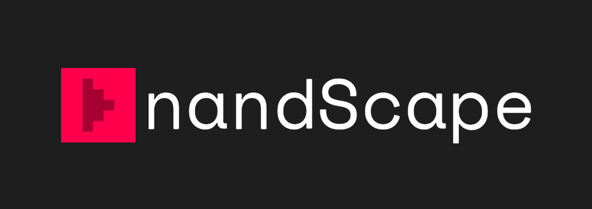

# nandScape



nandScape is a sandbox-style digital logic simulator for exploring how computation emerges from basic logic gates.  
It offers an intuitive grid-based environment where circuits can be drawn like pixel art and simulated in real time.  
From a single NAND gate to a complete processor, nandScape provides a space to design, test, and understand digital logic systems interactively.

---

## Purpose

nandScape is built as an open-ended creative environment rather than a conventional circuit design tool.  
It allows instant experimentation through a zero-tick simulation model, where every change is reflected immediately.  
Users can construct and observe digital systems dynamically, gaining insight into how simple logical relationships can scale into complex computational behavior.

---

## Features

- Zero-tick simulation with immediate signal propagation  
- Grid-based circuit construction inspired by pixel art design  
- Component-based system including inputs, wires, logic gates, and clocks  
- Circular dependency detection to identify and highlight feedback loops  
- Project-based save system, with multiple save slots within each project for modular circuit development  
  - For example, an ALU can be built in slot 0, a 1-bit adder in slot 1, and an 8-bit adder in slot 2  


---

## Download

The latest playable build of **nandScape** is available in [**Releases**](https://github.com/hanimuhamed/nandScape/releases)
1. Download the latest `.7z` build for your platform.  
2. Extract and run it, no installation required.

---

## Building from Source

If you’d like to explore or modify the project in Unity, you can clone it from source.

### Clone the repository
```bash
git clone https://github.com/hanimuhamed/nandScape.git
```
### Open in Unity

1. Launch **Unity 6000.1.13f1** (tested and verified version).  
2. Choose **Open Project** and select the cloned `nandScape` folder.  

> **Note:** The project is designed for Unity 6 (2025).  
> Newer Unity 6.x releases should remain compatible, though reimports may be required.

---

## License

This project is licensed under the **GNU General Public License v3.0 (GPL-3.0)**.  
You are free to use, modify, and distribute this software under the same open terms.  
Any derivative work must also remain open source under GPL-3.0.

For details, see the [LICENSE](./LICENSE) file.

---

## Known Issues

- Circular dependency detection can occasionally trigger **false positives**  
  - If this occurs, recompile the project  
  - Genuine feedback loops must be manually resolved

---

## Author

**Hani Muhamed**  
Created as an experimental logic sandbox, a digital playground for exploring how computation emerges from fundamental logic.  
Contributions, forks, and feedback are welcome.
